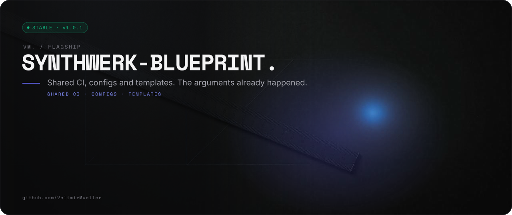
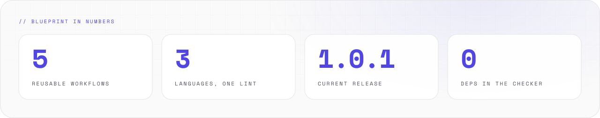
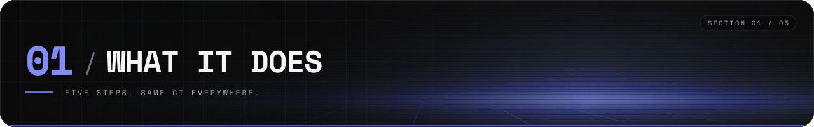
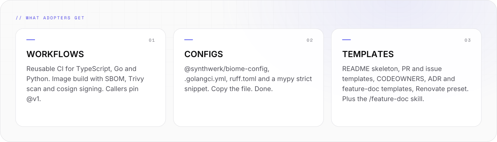
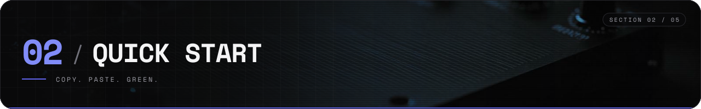
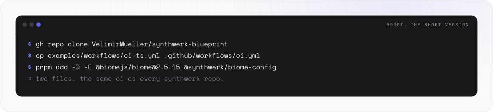
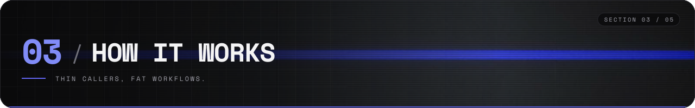
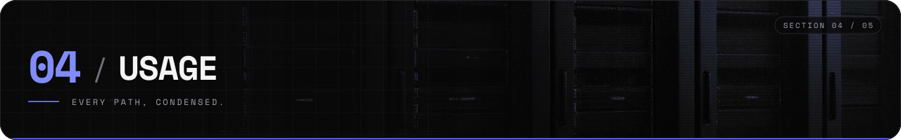
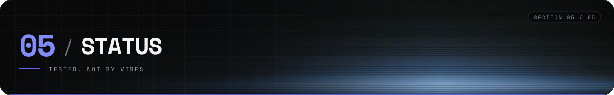
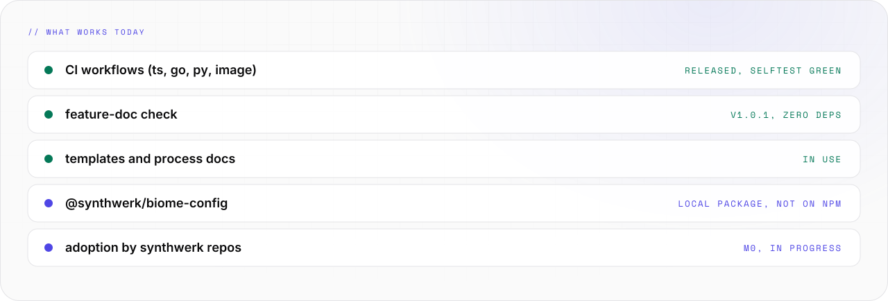

<picture>
  <source media="(prefers-color-scheme: light)" srcset="assets/banner/hero-v2-light.svg">
  
</picture>

<p align="center">

[](https://github.com/VelimirMueller/synthwerk-blueprint/actions/workflows/selftest.yml) [](CHANGELOG.md) [](https://github.com/VelimirMueller) [](LICENSE) [](#-03-how-it-works)

</p>

> Shared CI, configs and templates. The arguments already happened.

```text
 █████  ██  ██  ██  ██  ██████  ██  ██  ██   ██  ██████  █████   ██  ██
██      ██  ██  ███ ██    ██    ██  ██  ██   ██  ██      ██  ██  ██ ██
 ████    ████   ██████    ██    ██████  ██ █ ██  █████   █████   ████    █████
    ██    ██    ██ ███    ██    ██  ██  ███████  ██      ██ ██   ██ ██
█████     ██    ██  ██    ██    ██  ██   ██ ██   ██████  ██  ██  ██  ██
█████   ██      ██  ██  ██████  █████   █████   ██████  ██  ██  ██████
██  ██  ██      ██  ██  ██      ██  ██  ██  ██    ██    ███ ██    ██
█████   ██      ██  ██  █████   █████   █████     ██    ██████    ██
██  ██  ██      ██  ██  ██      ██      ██ ██     ██    ██ ███    ██
█████   ██████   ████   ██████  ██      ██  ██  ██████  ██  ██    ██    ██

 ------  shared ci for every synthwerk repo  -------------------------------
```

**synthwerk-blueprint** makes every `synthwerk-*` repo build, lint and document the same way.
A repo adopts it in five steps. Updates arrive as normal PRs. Nothing applies itself.

<picture>
  <source media="(prefers-color-scheme: dark)" srcset="assets/readme/stats-v2-dark.svg">
  
</picture>

<br>

## // 01 WHAT IT DOES



<picture>
  <source media="(prefers-color-scheme: dark)" srcset="assets/readme/features-v2-dark.svg">
  
</picture>

- One repo holds the CI, the lint configs and the templates for the whole synthwerk family.
- The caller workflow stays at about 10 lines. The job matrix lives here.
- A PR that changes feature source without its feature doc fails the check. The checker has zero dependencies.
- Every `run` step runs `bash -euo pipefail`. Every job gets `contents: read` only.

<br>

## // 02 QUICK START



<picture>
  <source media="(prefers-color-scheme: dark)" srcset="assets/readme/start-v2-dark.svg">
  
</picture>

Steps 1 and 2 of the adoption, the copy-paste part:

```bash
# 1) workflows (pick ci-ts.yml, ci-go.yml or ci-py.yml)
cp examples/workflows/ci-ts.yml .github/workflows/ci.yml
cp examples/workflows/feature-doc.yml .github/workflows/
cp examples/workflows/deliver.yml .github/workflows/   # only with a Dockerfile

# 2) lint config (TS / Vue)
pnpm add -D -E @biomejs/biome@2.5.15 @synthwerk/biome-config
```

`biome.json` in the repo root: `{ "extends": ["@synthwerk/biome-config"] }`.
Steps 3 to 5 (templates, Claude skill, required checks) are in [// 04 USAGE](#-04-usage).

<br>

## // 03 HOW IT WORKS



<picture>
  <source media="(prefers-color-scheme: dark)" srcset="assets/readme/flow-v2-dark.svg">
   @V1 TAG -> BLUEPRINT -> RENOVATE. The heavy workflows live here. Your repo stays thin." src="assets/readme/flow-v2-light.svg" width="100%">
</picture>

```text
 your repo                         this repo
 ┌────────────────────────┐   @v1  ┌─────────────────────────┐
 │ .github/workflows/     │  ───>  │ ts-ci  go-ci  py-ci     │
 │  ci.yml  (~10 lines)   │        │ image  feature-doc      │
 └────────────┬───────────┘        └─────────────────────────┘
              │
              └──>  required on main:  ci / required
                                      feature-doc / check

 both green ──> merge.  renovate re-pins the SHAs, 7 days late.
```

- **Reusable workflows.** Callers use `@v1`. The `v1` tag moves on minor and patch releases. A breaking input change makes `v2`.
- **Pinned supply chain.** Third-party actions are pinned by full commit SHA with a version comment. Renovate (`helpers:pinGitHubActionDigests`) keeps the pins current.
- **Least privilege.** Each job gets `contents: read` only. `image.yml` also needs `packages: write` and `id-token: write`. The caller must grant them, also for pull requests.
- **Renovate waits.** An update PR opens only when the release is 7 days old (`minimumReleaseAge`, `internalChecksFilter: strict`). A hijacked release has to stay quiet for a week.

<br>

## // 04 USAGE



### What is inside

- `.github/workflows/ts-ci.yml` — TypeScript / Vue: pnpm, `biome ci`, `vue-tsc` or `tsc`, Vitest, build, `v-html` ban
- `.github/workflows/go-ci.yml` — Go: gofmt, golangci-lint v2, `go test`, `go build`
- `.github/workflows/py-ci.yml` — Python: uv, ruff check + format, mypy strict, pytest
- `.github/workflows/image.yml` — image: build, SBOM (syft), Trivy (fails on critical), push to GHCR and cosign sign on `main` / `v*` only
- `.github/workflows/feature-doc.yml` — fails a PR that changes feature source without its feature doc
- `examples/workflows/` — thin caller workflows to copy into a repo
- `packages/biome-config/` — npm package `@synthwerk/biome-config` (Biome 2.5, formatter ON)
- `configs/go/`, `configs/python/` — `.golangci.yml`, `ruff.toml`, mypy strict snippet
- `templates/_common/` — README skeleton, PR and issue templates, CODEOWNERS, ADR and feature-doc templates, `renovate.json`
- `renovate/default.json` — Renovate preset
- `skills/feature-doc/` — Claude skill `/feature-doc` (plugin `synthwerk`)
- `actions/feature-doc/` — the feature-doc checker (Node, no dependencies)
- `docs/process/` — [Definition of Ready](docs/process/definition-of-ready.md) and [Definition of Done](docs/process/definition-of-done.md)

### Adopt the blueprint

1. **Workflows.** Copy `examples/workflows/ci-<ts|go|py>.yml` to `.github/workflows/ci.yml`.
   Copy `feature-doc.yml`. Copy `deliver.yml` when the repo has a `Dockerfile`.
2. **Lint config.** TS / Vue: `pnpm add -D -E @biomejs/biome@2.5.15 @synthwerk/biome-config`, then
   `biome.json` = `{ "extends": ["@synthwerk/biome-config"] }`.
   Go: copy `configs/go/.golangci.yml` to the repo root.
   Python: copy `configs/python/ruff.toml` to the repo root. Paste `configs/python/mypy.toml`
   into `pyproject.toml`.
3. **Templates.** Copy `templates/_common/` into the repo root. Replace every `<placeholder>`.
4. **Claude skill.** Add to `.claude/settings.json` in the repo:

   ```json
   {
     "extraKnownMarketplaces": {
       "synthwerk": { "source": { "source": "github", "repo": "VelimirMueller/synthwerk-blueprint" } }
     },
     "enabledPlugins": { "synthwerk@synthwerk": true }
   }
   ```

   Or install it once: `/plugin install synthwerk --marketplace VelimirMueller/synthwerk-blueprint`.
   Add to the repo `CLAUDE.md`: "Run `/feature-doc` before a PR."
5. **Required checks.** Set `ci / required` and `feature-doc / check` as required checks on
   `main` (ruleset in `synthwerk-infra`).

### Rules for dependency updates (Renovate)

- Renovate opens an update PR only when the release is **7 days** old. This blocks a hijacked release that is pulled within days.
- Only patch updates of dev dependencies merge automatically, after the 7 days and green CI.
- Security fixes (`vulnerabilityAlerts`) do not wait. They get the label `security`.
- Majors, base images, Biome and `@synthwerk/*` packages never merge automatically.

### Development

```sh
just lint   # actionlint, zizmor, Biome
just test   # node --test: Biome, golangci-lint, ruff, mypy configs and the feature-doc checker
```

- Tools: Node 24 + pnpm, Go 1.27, golangci-lint v2.14, uv (runs ruff 0.16.10, mypy 2.4.0,
  zizmor 1.30.1), actionlint 1.7.12, just.
- Tests live in `tests/`. Fixtures live in `tests/fixtures/`.

<br>

## // 05 STATUS



<picture>
  <source media="(prefers-color-scheme: dark)" srcset="assets/readme/status-v2-dark.svg">
  
</picture>

```text
[ STATUS ]  v1.0.1, released 2026-10-09
[ WORKS  ]  ts, go, py, image, feature-doc
[ NEXT   ]  npm publish, synthwerk adoption
```

The lint and test suites run in CI (`selftest.yml`) and locally:

```sh
just lint   # actionlint, zizmor, Biome
just test   # node --test: Biome, golangci-lint, ruff, mypy configs and the feature-doc checker
```

Releases and the moving `v1` tag are documented in [CHANGELOG.md](CHANGELOG.md).

<br>

```text
-- EOF --------------------------------- FIVE FILES. ONE STANDARD. --
```

---

<sub>VM. studio / flagship · open source · look per <code>vm-brand</code> playbook · [MIT](LICENSE) © 2026 Velimir Mueller</sub>
