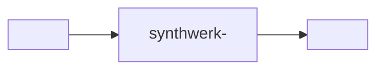

<!-- Synthwerk README skeleton (D-16). Replace every <placeholder>. Keep the section order. -->
<picture>
  <source media="(prefers-color-scheme: dark)" srcset="docs/assets/banner-dark.svg">
   — <tagline>" src="docs/assets/banner-light.svg" width="100%">
</picture>

[](https://github.com/VelimirMueller/synthwerk-<role>/actions/workflows/ci.yml)
[](https://github.com/VelimirMueller/synthwerk-<role>/releases)
[](LICENSE)
[](https://github.com/VelimirMueller/synthwerk-contracts)

## In 30 seconds

- <What the service does, in one sentence.>
- <Who calls it, or what it calls.>
- <One number: latency, limit or size.>

## Where it fits



- Ecosystem map: [synthwerk](https://github.com/VelimirMueller/synthwerk).

## Quick start

```sh
just dev    # start the service and its dependencies
just test   # run unit, integration, contract and component tests
```

## API and events

- API spec: [synthwerk-contracts/<path>](https://github.com/VelimirMueller/synthwerk-contracts).
- Events: <link to the event catalog entries>.

| Endpoint | Use | Code |
|---|---|---|
| `GET /healthz` | Liveness. No dependency checks. | 200 / 503 |
| `GET /readyz` | Readiness. Checks the required dependencies. | 200 / 503 |
| `GET /v1/status` | Build info and every dependency check. Needs a service or admin token. | 200 |

## Configuration

| Variable | Required | Use |
|---|---|---|
| `SYNTHWERK_<NAME>` | yes | <use> |

- Names only. Values live in the environment, never in the repo.

## Development

```text
<layout tree: cmd/, internal/ or src/, tests/>
```

| Level | Folder | Command |
|---|---|---|
| unit | `tests/unit/` | `just test-unit` |
| integration | `tests/integration/` | `just test-integration` |
| contract | `tests/contract/` | `just test-contract` |
| component | `tests/component/` | `just test-component` |

## Deploy

- Merge to `main` deploys to **dev**. A `vX.Y.Z` tag deploys to **stg**.
- **prd** gets the same image digest after a manual approval.
- Infrastructure: [synthwerk-infra](https://github.com/VelimirMueller/synthwerk-infra).

## Features

<!-- One row per docs/features/*.md. /feature-doc keeps this table current. -->

| Feature | Status |
|---|---|
| [<title>](docs/features/<slug>.md) | <status> |

## Security

- Report a vulnerability as described in [SECURITY.md](SECURITY.md).

## License

- [MIT](LICENSE)
